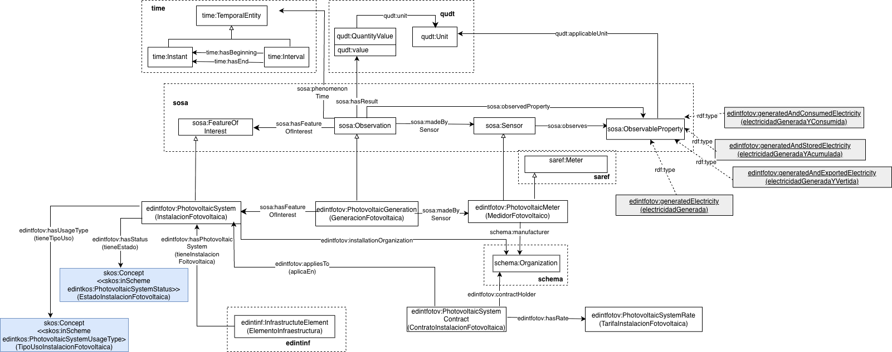

# Ontología de Instalación Fotovoltaica (Ontology of Photovoltaic System)

La ontología de instalaciones fotovoltaicas describe todos los conceptos relacionados con las instalaciones de este tipo que se encuentran en los elementos de la infraestructura de un municipio y la medición de la generación, consumo, acumulación y vertido de electricidad en la red.

# Propósito y alcance de la ontología (Purpose and scope of the ontology)

El propósito de esta ontología es el de proporcionar un vocabulario común para la representación de los conceptos relacionados con las instalaciones fotovoltaicas que se encuentran en los elementos de la infraestructura de un municipio y la medición de la generación, consumo, acumulación y vertido de electricidad en la red realizada por estas instalaciones.

# Prefijo y espacio de nombres (Prefix and namespace)
El prefijo de la ontología de Instalación fotovoltaica es: edintfotov y es publicada en el espacio de nombres: [http://vocab.linkeddata.es/datosabiertos/def/urbanismo-infraestructuras/fotovoltaica#](http://vocab.linkeddata.es/datosabiertos/def/urbanismo-infraestructuras/fotovoltaica#) 

# Modelo conceptual (Ontology conceptualization)

# Estructura del repositorio (Repository structure)

El repositorio contiene los siguientes directorios:

| Folder | Description |
|--------|--------------|
| **diagrams/** | Stores diagrams and other resources representing the conceptual model of the ontology (e.g., class hierarchies, relationships). |
| **documentation/** | Stores the HTML or human oriented documentation of the ontology and related artefacts. |
| **examples/** | Includes examples that demonstrate how to instantiate or apply the ontology in real data scenarios. |
| **kos/** | Stores controlled vocabularies or KOS implementation, usually SKOS implementations in rdf. |
| **ontology/** | Contains the actual ontology implementation files in formats such as `.owl`, `.rdf`, `.ttl`, or `.jsonld`. |
| **requirements/** | Contains all documents used to define the ontology’s requirements: data example, competency questions, functional requirements, use cases, etc. |
| **shapes/** | Contains the SHACL shapes used to define and validate ontology constraints. |

# Mantenimiento y evolución (Maintenance and evolution)

Para manejar las incidencias o mejoras sugeridas con respecto a la ontología, recomendamos seguir las guías proporcionadas en ([Issues Management](./ISSUES.md)) para generar una incidencia.

# Financiación (Funding)

Esta ontología ha sido desarrollada en el contexto del Espacio de Datos para las Infraestructuras Urbanas Inteligentes ([EDINT](https://edint.es)).

